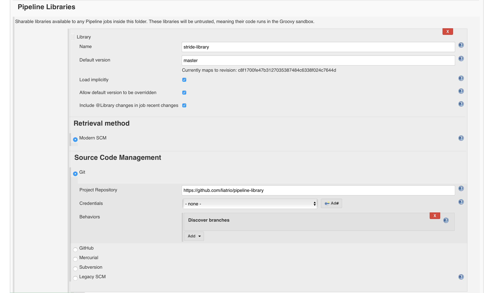
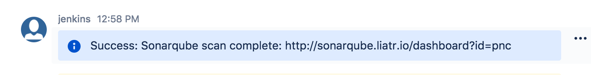
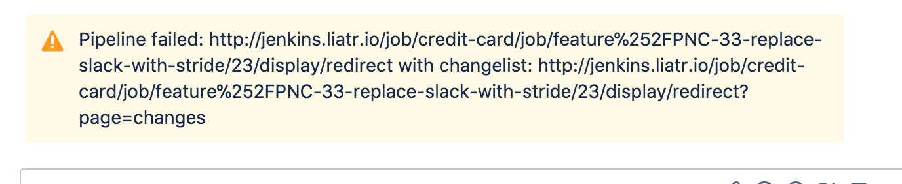
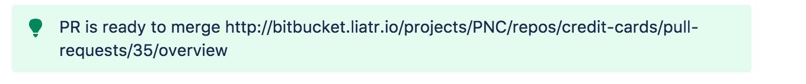

# stride-pipeline-library
a shared library between example pipelines

## Setup
This is a pipeline library to be used with Jenkins pipelines. It can be setup multiple ways, but the simplest way is to implicitly load the lbrary at the 
global or folder level, and reference it at the top of each Jenkinsfile. 

 

#### Environment Variables that need to be set

STRIDE_TOKEN : Api token. To generate, create a custom integratoin in admin settings and store in Jenkins credential provider.  

STRIDE_ORGID : This is the org id. Easiest way to find it is open up stride in a browser.

#### Jenkinsfile setup

Specify the library name at the top of the jenkinsfile above the pipeline definition. `library 'stride-library'`

#### Methods available in this library
Once the library is configured at the top of the jenkinsfile and configured at the folder or global level, you'll 
be able to use the `StrideSend` method. 

`StrideSend(String conversationId, String messageIcon, String message)`

String ConversationId : taken from browser
String MessageIcon : options 'tip','info','warning'
String Message: message you want posted 

### Examples

StrideSend("someId","info", "Success: Sonarqube scan complete: http://sonarqube.liatr.io/dashboard?id=pnc")

 
StrideSend(someId, "warning", Pipeline failed: ${RUN_DISPLAY_URL} with changelist: ${RUN_CHANGES_DISPLAY_URL}")

StrideSend(someId, "tip","PR is ready to merge ${CHANGE_URL}")
